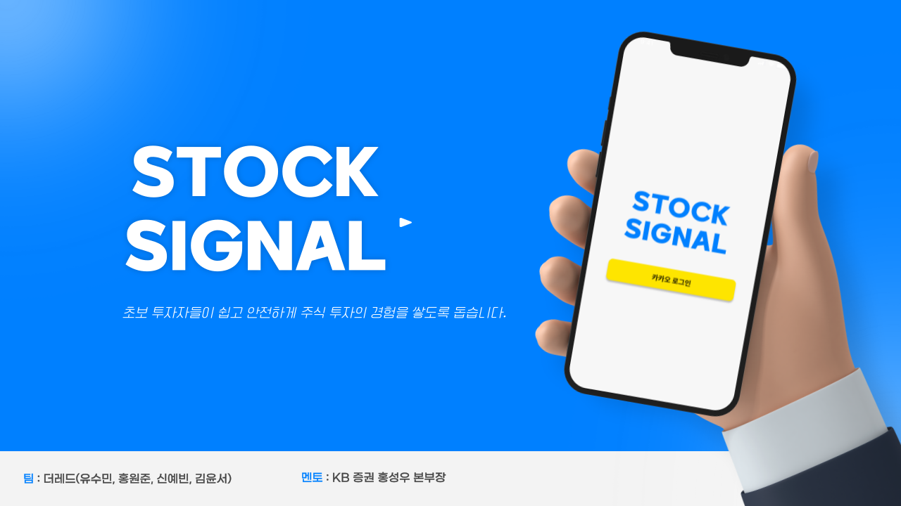
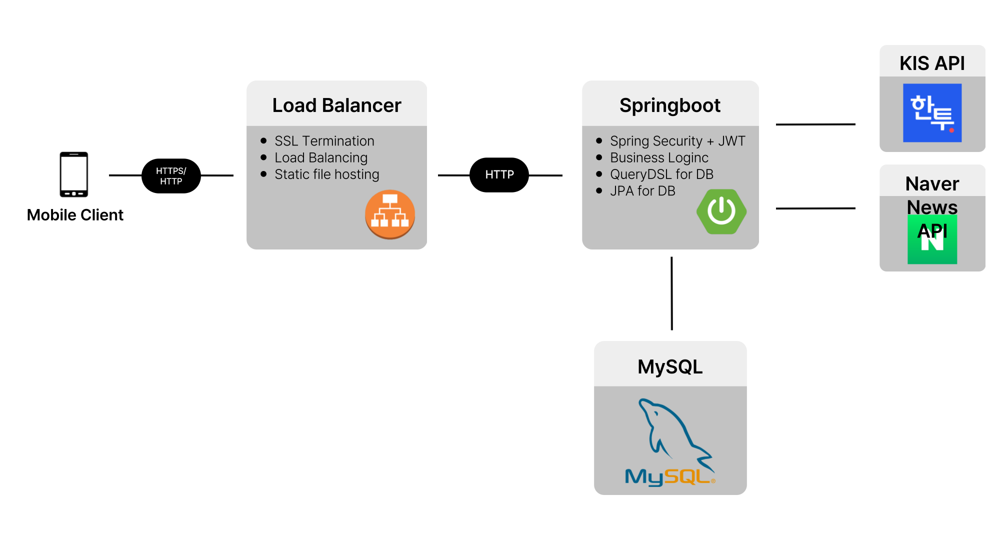
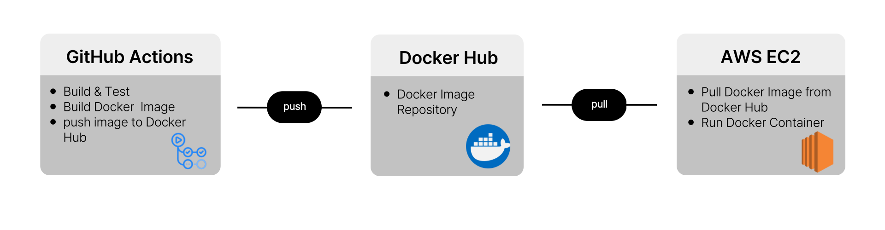

<br>
<br>

# 🍎 Stock Signal 프로젝트 소개

### “초보 투자자들이 쉽고 안전하게, 주식 투자의 경험을 쌓도록 돕습니다.”
주식 투자에 어려움을 겪는 주린이(주식+어린이)를 위해, 기존 MTS의 복잡한 요소를 개선한 간편한 주식 관리 시스템을 제공합니다. 

<br>


## 🏋🏻‍♀️ Team '더레드'
| 팀 | 이름 | 전공 | 역할  | 깃허브 아이디 |
|----| ----- | ----- | -------- | ------- |
| 팀장 | 유수민 | 컴퓨터공학전공 | 백엔드 개발  | proysm |
| 팀원 | 홍원준 | 컴퓨터공학전공 | 백엔드 개발  | price126 |
| 팀원 | 신예빈 | 컴퓨터공학전공 | IOS 개발  | ShinYEB |
| 팀원 | 김윤서 | 경영학과 | Android 개발  | yunssup |

<br>


## 1. 개발 환경 및 기술 스택

##### Back-end
  
<br>
  

##### Database
 

##### CI/CD & DevOps
  


##### IOS


##### Android


#### AI

##### Tools


<br>


## 2. 시스템 아키텍처

```
📌 백엔드 아키텍처
```


```
📌 CI/CD 아키텍처
```

<br>


## 3. 프로젝트 디렉토리 구조

<details>
<summary>back/src 구조 확인하기</summary>
<div markdown="1">

```
.
├── main
│   ├── generated
│   ├── java
│   │   └── com
│   │       └── thered
│   │           └── stocksignal
│   │               ├── apiPayload
│   │               ├── app
│   │               │   ├── controller
│   │               │   └── dto
│   │               │       ├── kakao
│   │               │       ├── kis
│   │               │       └── user
│   │               ├── config
│   │               ├── domain
│   │               │   ├── entity
│   │               │   ├── enums
│   │               │   └── session
│   │               ├── jwt
│   │               ├── repository
│   │               ├── service
│   │               │   ├── company
│   │               │   ├── kakao
│   │               │   ├── myBalance
│   │               │   ├── news
│   │               │   ├── scenario
│   │               │   ├── trade
│   │               │   └── user
│   │               ├── util
│   │               └── websocket
│   └── resources
│       ├── static
│       └── templates
└── test
    └── java
        └── com
            └── thered
                └── stocksignal

```

</div>
</details>

<details>
<summary>ios/src 구조 확인하기</summary>
<div markdown="1">

```

```

</div>
</details>

<details>
<summary>android/src 구조 확인하기</summary>
<div markdown="1">

```

```

</div>
</details>

<br>


## 4. 주요 기술 설명

```
1. 30일 AI 예측 그래프
```

- GRU 모델을 기반으로 30일치 예상 주가 그래프를 생성하여 제공합니다.

- 사용자는 AI 예측 그래프를 통해 주가의 흐름을 파악하고 매매 타이밍을 학습할 수 있습니다.


```
2. 자동매매 시나리오 작성
```

- 3가지 종류의 자동매매 시나리오를 생성할 수 있습니다.

- 각 시나리오는 언제든 구성 가능하며, 각 종목 별로 개별 시나리오를 적용할 수 있습니다.


```
3. 과거 데이터로 투자 연습 (시뮬레이션)
```

- 과거의 주식 정보(90일)을 이용하여 투자 연습 가능

<br>

## 📱 데모 영상
[🔗 데모 영상 확인](https://proysm.notion.site/DEMO-154b4ca715b080b2ad95d1168621a154?pvs=4 "데모 영상 확인")

<br>

## 📪 개발 문서
[🔗 API 명세서 확인](https://proysm.notion.site/API-154b4ca715b0809ca43ceb2a9155b000?pvs=4 "API 명세서")

[🔗 ERD 확인](https://proysm.notion.site/ERD-154b4ca715b080c1ad52e0d5af006fe0?pvs=4 "ERD")

<br>

## 🎀 한국투자증권 API
[🔗 한국투자 Open API](https://apiportal.koreainvestment.com/login "한국투자 Open API")

[🔗 모의투자 가능한 API](https://proysm.notion.site/API-154b4ca715b080878daacd626ce86a3b?pvs=4 "한국투자증권 Open API")

<br>

## 🌴 Branch Style
| 이름 | 설명 |
| --- | --- |
| main | PR을 거쳐 오류가 없는 브랜치 |
| prod | 배포에 사용되는 브랜치 |
| back | 백엔드 개발에 사용되는 브랜치 |
| ios | ios 개발에 사용되는 브랜치 |
| android | android 개발에 사용되는 브랜치 |
| -feat-이슈번호 | 기능 개발에 사용되는 브랜치 |
| -update-이슈번호 | 기능 업데이트에 사용되는 브랜치 |
| -refactor-이슈번호 | 리팩토링에 사용되는 브랜치 |
| -bug-이슈번호 | 버그 해결에 사용되는 브랜치 |

<br>

## 🎯 Commit Convention
| 제목 | 설명 |
| --- | --- |
| Feat : | 새로운 기능 추가 |
| Fix : | 버그 수정 |
| Docs : | 문서 수정 |
| Update : | 기타 업데이트 |
| Style : | 코드 포맷 변경, 세미콜론 누락, 코드 변경 없음 |
| Refactor : | 프로덕션 코드 리팩터링 |

